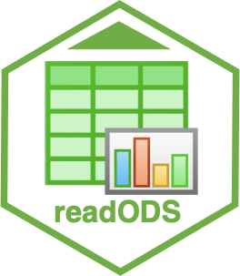

<!-- README.md is generated from README.Rmd. Please edit that file -->

```{r, include = FALSE}
knitr::opts_chunk$set(
  collapse = TRUE,
  comment = "#>",
  fig.path = "man/figures/README-",
  out.width = "100%"
)
```

# readODS 

<!-- badges: start -->
[](https://CRAN.R-project.org/package=readODS)
[](https://lifecycle.r-lib.org/articles/stages.html#stable)
[](https://app.codecov.io/gh/ropensci/readODS?branch=master)
[](https://github.com/ropensci/software-review/issues/386)
[](https://github.com/ropensci/readODS/actions/workflows/R-CMD-check.yaml)
<!-- badges: end -->

The only goal of readODS is to enable R to read and write OpenDocument Spreadsheet (ODS) files.

## Installation

Install the latest stable version from CRAN: 

```r
install.packages("readODS")
```

from R-universe:

```r
install.packages("readODS", repos = "https://ropensci.r-universe.dev")
```

Or install the development version from Github:

```r
devtools::install_github("ropensci/readODS")
```

## Usage

In almost all use cases, you only need two functions: `read_ods` and `write_ods`. Simple.

#### Reading

```{r}
library(readODS)
read_ods("starwars.ods")
```

Reading from the 2nd sheet

```{r}
read_ods("starwars.ods", sheet = 2)
```

Reading from a specific range

```{r}
read_ods("starwars.ods", sheet = 2, range = "A1:C11")
```

#### Writing

```{r}
## preserve the row names
write_ods(mtcars, "mtcars.ods", row_names = TRUE)
```

Appending a sheet

```{r}
write_ods(PlantGrowth, "mtcars.ods", append = TRUE, sheet = "plant")
```

```{r}
## Default: First sheet
read_ods("mtcars.ods")
```

```{r}
read_ods("mtcars.ods", sheet = "plant", range = "A1:B10")
```

### Text Encoding

In older versions of R (<4.2) on Windows, the default encoding for text is not UTF-8, and instead dependes on your locale. This can cause problems processing characters that are not part of the character set R is using (ususally [Windows-1252](https://en.wikipedia.org/wiki/Windows-1252)). Sheets written using these characters generally contains errors. The problem can be fixed by upgrading to a version of R >= 4.2.

**Radian:** Even for up-to-date versions of R, these issues with character encoding are still a known issue with Radian. Their suggested workaround is [here](https://github.com/randy3k/radian/issues/269#issuecomment-1169663251).


### Misc

The logo of readODS is a remix of LibreOffice Calc v6.1 icon created by the Document Foundation. The original LibreOffice logo is licensed under the [Creative Commons Attribution Share-Alike 3.0 Unported License](https://wiki.documentfoundation.org/File:LibO6_MIME.svg). readODS is not a product of the Document Foundation. The logo of readODS is licensed under the [Creative Commons Attribution Share-Alike 3.0 Unported License](https://creativecommons.org/licenses/by-sa/3.0/).

The creator of this package is Gerrit-Jan Schutten. The current maintainer is Chung-hong Chan. This package benefits from contributions by Peter Brohan, Thomas J. Leeper, John Foster, Sergio Oller, Jim Hester, Stephen Watts, Arthur Katossky, Stas Malavin, Duncan Garmonsway, Mehrad Mahmoudian, Matt Kerlogue, Detlef Steuer, Michal Lauer, and Till Straube.

This package emulates the behaviors of `readxl::read_xlsx`, `writexl::write_xlsx` and `xlsx::write.xlsx`.

This package should be a silent member of `rio`, so that you don't need to care about file format anymore.

### License

GPL3

### Contributing

Contributions in the form of feedback, comments, code, and bug report are welcome.

* Fork the source code, modify, and issue a [pull request](https://docs.github.com/en/github/collaborating-with-issues-and-pull-requests/creating-a-pull-request-from-a-fork).
* Issues, bug reports: [File a Github issue](https://github.com/ropensci/readODS).

Please note that this package is released with a [Contributor Code of Conduct](https://ropensci.org/code-of-conduct/). By contributing to this project, you agree to abide by its terms.

```{r, include = FALSE}
unlink("mtcars.ods")
```
